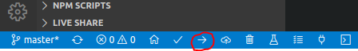

# OTAClient

## Usecases

### Fresh out the box

1. Open OtaClient in VSCode (folder with platform.ini)
2. Hook the esp32 to your computer via usb-cable
3. Upload the OtaClient arrow pointing to the right in the bottom left corner (don't unplug the esp32)
   
4. Connect to the new Hotspot from the esp32
5. Enter the credentials of a 2.4 Ghz wlanrouter to `192.168.10.1/setconfig?ssid=\<ssid>&password=\<password>&app_name=\<app_name>&thingname=\<thing_name>`
6. Press the restart-button of the esp32

### Getting new Firmware

1. Esp32 will check if the firmware version in its storage is different then the one online
2. Update the firmware on the website
3. Esp32 will restart with new downloaded firmware
